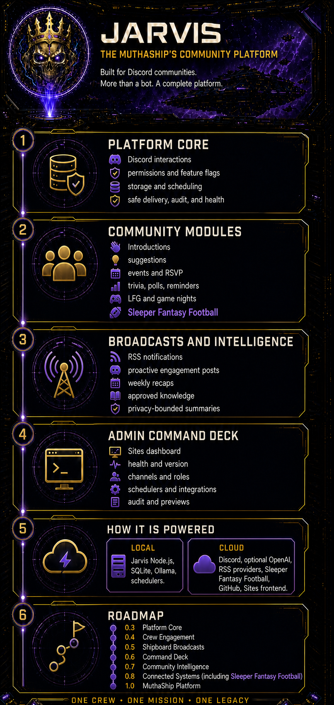

# Jarvis Discord Bot



[](https://nodejs.org/)
[](https://www.typescriptlang.org/)
[](https://github.com/tjhiggy/Jarvis/actions/workflows/ci.yml)
[](SECURITY.md)
[](LICENSE.md)

Jarvis is the Muthaship's themed AI copilot for Discord: concise technical
answers, shipboard personality, bounded memory, reminders, polls, web-grounded
research, and read-only fantasy football data. It is designed to be useful
without pretending to be a moderator, administrator, or autonomous operator.

Jarvis is The Muthaship's answer-only advisory AI: useful first, shipboard wit
second, imaginary moderator powers never. It answers questions in Discord,
keeps bounded conversation history per channel or thread, and can use local or
hosted AI without pretending an interface is a superpower.

Release package: `0.6.0` | Runtime: Node.js 22+ | License: proprietary, except
the Code of Conduct under CC BY 4.0

Share the [Jarvis community platform overview](assets/jarvis-admin-overview-infographic-v3.png)
with Muthaship server administrators for a visual summary of current
capabilities, local and cloud dependencies, safety boundaries, and planned
enhancements.

## What ships

| Verified capability                                                                                                                                                                                                                                                                                                                                                  | Current boundary                                                                                                                                                                                                                               |
| -------------------------------------------------------------------------------------------------------------------------------------------------------------------------------------------------------------------------------------------------------------------------------------------------------------------------------------------------------------------- | ---------------------------------------------------------------------------------------------------------------------------------------------------------------------------------------------------------------------------------------------- |
| `/ask`, `/search`, `/forget`, `/faq`, `/knowledge`, `/catch-me-up`, `/channel-summary`, `/help`, `/status`, `/reminder`, `/introduce`, `/suggest`, `/post`, `/event`, `/game-night`, `/lfg`, `/recap`, `/trivia`, `/birthday`, `/roles`, `/engagement`, read-only `/fantasy standings` or `/fantasy matchup week:<number>`, read-only `/github`, and direct mentions | Engagement and knowledge features are restricted to configured channels, approved sources, and configured administrator roles. `/post`, `/github`, and `/knowledge` retain their explicit preview, repository, and source-approval boundaries. |
| Optional `/poll` and `/poll-close` commands                                                                                                                                                                                                                                                                                                                          | Disabled until poll administrators and a voter secret are configured; only configured administrators can create or close polls                                                                                                                 |
| Short conversation context stored in SQLite                                                                                                                                                                                                                                                                                                                          | Isolated by guild and channel or thread; not encrypted by the application                                                                                                                                                                      |
| Local Ollama and OpenAI Responses providers                                                                                                                                                                                                                                                                                                                          | Exactly one provider is selected at startup                                                                                                                                                                                                    |
| Optional balanced Tavily grounding                                                                                                                                                                                                                                                                                                                                   | Disabled without `TAVILY_API_KEY`; current and evidence-sensitive factual prompts can search, while results remain untrusted evidence                                                                                                          |
| Bounded input, output, retries, rate limits, retention, and stored rows                                                                                                                                                                                                                                                                                              | Single-process controls, not distributed coordination                                                                                                                                                                                          |
| Local responses for clearly unsupported action requests                                                                                                                                                                                                                                                                                                              | A UX guardrail only; it neither authorizes actions nor replaces permission checks                                                                                                                                                              |
| Native Node.js and hardened Docker Compose deployment paths                                                                                                                                                                                                                                                                                                          | One active Jarvis process and one SQLite database are the supported topology                                                                                                                                                                   |
| Shipboard broadcasts: RSS digests, approved proactive posts, recaps, event reminders, birthday mentions, and trivia result cards                                                                                                                                                                                                                                     | Every scheduled category is server-scoped, destination-allowlisted, pauseable, lease-fenced, and observed without message content. Public posts and member preferences are deliberately separate products.                                     |

Jarvis does not moderate Discord, create roles, change channels, or edit content owned
by others, execute shell commands, access arbitrary files, write to GitHub, or
grant itself tools. The contracts in `src/extensions/contracts.ts` are inert
design seams. Calling them "integrations" would be marketing with a fake
mustache.

## Project status

Jarvis is actively maintained for the private Muthaship Discord server. The
current production path is native Node.js on UselessBoi's local ship computer,
with SQLite and Ollama hosted locally. Discord, optional OpenAI, and optional
Tavily grounding remain external services. See [Deployment](docs/DEPLOYMENT.md)
for the supported rollout and rollback procedure.

## Screenshots and demos

The `assets/` directory contains the administrator overview and product visuals.
For a live walkthrough, invite Jarvis to an authorized development server and
try `/help`, `/status`, `/ask`, `/fantasy standings`, and `/forget`.

The canonical public profile copy, visual assets, Developer Portal checklist,
and capability boundaries are documented in [Discord profile package](docs/DISCORD_PROFILE.md).

See [Architecture](docs/ARCHITECTURE.md) for the source-backed component and
trust-boundary detail, the [Platform Architecture Roadmap](docs/PLATFORM_ARCHITECTURE_ROADMAP.md)
for the core-platform release plan, and [Roadmap](docs/ROADMAP.md) for the sharp line between
shipped and proposed work.

## Architecture at a glance

Jarvis is a layered modular monolith with no HTTP server or inbound listening
port:

1. `discord.js` receives outbound Discord Gateway events and interactions.
2. Discord adapters derive request context and enforce server, channel, thread,
   and reply-safety rules.
3. The conversation service owns shared prompt normalization, input limits,
   de-duplication, per-user rate limits, persona mode, history isolation,
   unsupported-action UX responses, and coordinated storage changes.
4. Optional Tavily search grounds current and evidence-sensitive factual
   requests.
5. The selected Ollama or OpenAI adapter produces a bounded answer.
6. SQLite stores bot-owned conversation records and, when enabled, anonymous
   poll state. Safe delivery neutralizes mentions and splits long replies.

The copied `.env.example` is Ollama-first. Ollama runs locally and needs no API
credits. OpenAI is an optional hosted provider, and Tavily is an optional web
grounding service. Provider choice changes where prompts are processed, not
what authority Jarvis has.

For v0.7, the measured local recommendation remains `gemma3:4b`. It scored
higher and responded substantially faster than `qwen3:4b` on the current
16 GB host. The evidence and routing decision are in
[`docs/adr/001-community-intelligence-model-strategy.md`](docs/adr/001-community-intelligence-model-strategy.md).

## First local run

### Prerequisites

- Node.js 22 or newer and npm.
- Ollama installed locally for the default provider.
- A Discord application installed in a server you are authorized to configure.
- The nonprivileged `Guilds` and `GuildMessages` intents, plus only View
  Channel, Read Message History, Send Messages, and Send Messages in Threads
  where needed.

Create the application, bot identity, least-privilege installation, and
development guild using [Discord setup](docs/DISCORD_SETUP.md). Do not grant
Administrator. It is not a shortcut; it is a security incident wearing a
checkbox.

Pull the default local model:

```powershell
ollama pull gemma3:4b
```

Then use this four-command local quick start:

1. Install exactly the locked dependencies.

   ```powershell
   npm ci
   ```

2. Create the ignored local environment file.

   ```powershell
   Copy-Item .env.example .env
   ```

   Before continuing, set `DISCORD_TOKEN`, `DISCORD_CLIENT_ID`, and
   `DISCORD_GUILD_ID` in `.env`. Keep real values out of commits, tickets,
   screenshots, and chat. The default `AI_PROVIDER=ollama` does not require an
   OpenAI key.

3. Register the guild-scoped commands in the configured development server.

   ```powershell
   npm run register-commands
   ```

   Polls disabled produces the eight core commands. Configuring both poll
   credentials adds `/poll` and `/poll-close`. The script replaces only this
   application's commands in the configured development guild.

4. Start the development watcher.

   ```powershell
   npm run dev
   ```

Mention the bot with a nonempty prompt or use `/ask`. Stop with `Ctrl+C` so the
process closes SQLite and disconnects cleanly. For the compiled path, run
`npm run build` followed by `npm start`.

Every setting, default, and validation rule is in
[Configuration](docs/CONFIGURATION.md). If startup sulks, use
[Troubleshooting](docs/TROUBLESHOOTING.md) instead of randomly rotating knobs.

## Optional providers

### OpenAI

Set `AI_PROVIDER=openai`, provide `OPENAI_API_KEY` through the ignored `.env`
file or an approved secret manager, and choose an available `OPENAI_MODEL`.
OpenAI API usage is billed separately from ChatGPT. Keep keys project-scoped,
restrict access where practical, and rotate any exposed credential.

### Tavily web grounding

Set `TAVILY_API_KEY` to enable `/search` and balanced automatic grounding.
Automatic grounding covers current information and evidence-sensitive factual
claims, including history and origins, government programs and laws,
relationships between named entities, dated statistics or quotations, and
medical, legal, financial, and evidence-dependent scientific claims. Basic
definitions, supplied-text work, ordinary drafting or creative requests, and
timeless coding help normally remain local to preserve Tavily usage and the
extra search latency.

Casual greetings, thanks, jokes, and emotional check-ins stay local even when
they contain social uses of words such as `today`. Jarvis gives these prompts a
trusted concise-response instruction of no more than three short sentences and
approximately 80 words. Explicit detail requests remain in standard mode, and
responses are not chopped off after generation. `/search` always overrides
automatic routing and forces grounding when Tavily is configured.

An automatic search that misses the in-process cache sends a Tavily request and
consumes provider usage; an equivalent cached query does not make another
request. Jarvis requests bounded summaries, appends sanitized source links to
grounded answers, and treats retrieved text as data rather than instructions.
For evidence-sensitive answers, an application-enforced gate requires explicit
two-subject evidence for relationship claims, authoritative sources for
government claims, and consistency across accepted results. It also withholds
model output that introduces unsupported dates, people, quotations, laws,
statistics, causal claims, or excessive novel factual content. The router and
gate reduce risk but cannot make language-model output infallible; use
`/search` when an excluded prompt still needs web evidence.

## Commands

| Command                                                                        | What it does                                                                                                                                                  |
| ------------------------------------------------------------------------------ | ------------------------------------------------------------------------------------------------------------------------------------------------------------- |
| `/ask prompt:<question>`                                                       | Sends a bounded question, persona instructions, and recent channel or thread history to the selected AI provider.                                             |
| `/search query:<question>`                                                     | Requires Tavily and forces current web grounding before the selected AI provider answers.                                                                     |
| `/forget`                                                                      | Deletes Jarvis-owned conversation history for the current guild channel or thread.                                                                            |
| `/faq`                                                                         | Lists the approved local FAQ questions publicly without calling AI, Tavily, or SQLite.                                                                        |
| `/faq topic:<approved topic>`                                                  | Posts the selected answer from the active approved local catalog publicly without provider usage cost or stored conversation history.                         |
| `/knowledge query:<search>`                                                    | Searches administrator-approved MuthaShip knowledge without reading Discord history or calling the model.                                                     |
| `/knowledge list` / `/knowledge approve id:<id>` / `/knowledge revoke id:<id>` | Administrators inspect and change this server's approval override for catalog sources. These commands never edit the checked-in catalog.                      |
| `/catch-me-up`                                                                 | Privately shows up to the 12 most recent Jarvis conversation messages retained for the current channel or thread. It never fetches arbitrary Discord history. |
| `/channel-summary`                                                             | Privately summarizes up to 20 retained Jarvis messages from the last 24 hours for the current channel or thread. It never fetches arbitrary Discord history.  |
| `/server-search query:<text>`                                                  | Privately searches up to 100 retained Jarvis messages in the current channel or thread and returns at most five source-timestamped matches.                   |
| `/my-stats status` / `/my-stats enable` / `/my-stats disable`                  | Privately manages an optional 30-day count of your successful Jarvis commands. Opt-out is the default; disabling deletes retained counts.                     |
| `/image generate prompt:<description>`                                         | Lets a configured administrator generate one bounded image in the approved channel when the feature is explicitly enabled.                                    |
| `/post preview content:<message>`                                              | Administrators preview and explicitly confirm a bounded MuthaShip transmission to the configured test channel.                                                |
| `/help`                                                                        | Lists the available commands and safety boundary.                                                                                                             |
| `/status`                                                                      | Reports Discord configuration, SQLite health, selected provider configuration, web-search configuration, and FAQ readiness without a model request.           |
| `/config`                                                                      | Administrator-only ephemeral view of effective non-secret configuration, masked destinations, enabled features, provider readiness, and build identity.       |
| `/reminder set in:<duration> message:<text>`                                   | Creates a personal reminder for the original allowed channel or thread. `in` accepts 1 minute through 30 days; text is trimmed to 500 characters.             |
| `/reminder list`                                                               | Privately lists this user's retained reminders in the current server.                                                                                         |
| `/reminder cancel id:<id>`                                                     | Privately cancels one of this user's active reminders. Delivered or failed reminders cannot be cancelled.                                                     |
| `/poll question:<text> option1:<text> option2:<text> duration:<preset>`        | Configured administrators create an anonymous two-to-five-option poll. Available only when polls are enabled.                                                 |
| `/poll-close poll_id:<id>`                                                     | Configured administrators close an open poll early. Available only when polls are enabled.                                                                    |
| `/birthday set                                                                 | show                                                                                                                                                          | delete`       | Members opt in to a month-and-day birthday announcement, view it privately, or delete it. Announcements use the configured birthday channel. |
| `/github repository                                                            | issue                                                                                                                                                         | pull-request` | Reads metadata from the configured GitHub repository. The integration is read-only and never writes to GitHub.                               |
| `/roles`                                                                       | Shows the explicitly allowlisted self-service roles. Jarvis can assign only configured roles below its bot role.                                              |
| `/profile create                                                               | view                                                                                                                                                          | edit          | hide                                                                                                                                         | show                                                                                                                                                                 | delete` | Creates an opt-in, server-scoped crew profile through private confirmation. Hidden or missing profiles share one neutral response. |
| `/engagement proactive preview                                                 | enable                                                                                                                                                        | pause         | status`                                                                                                                                      | Administrators preview or control proactive posts. Delivery is disabled by default and remains bounded by the configured activity channel, quiet hours, and cadence. |

All commands are server-only. `/ask`, `/search`, `/forget`, `/faq`, `/knowledge`, `/catch-me-up`, and `/channel-summary` enforce
`ALLOWED_CHANNEL_IDS`; an allowlisted parent channel also permits its threads.
Each thread still keeps separate history. FAQ replies still pass through the
same mention-neutralizing delivery boundary as other replies.

### Personal reminders

`/reminder set`, `list`, and `cancel` are personal, server-only commands. Their
validation, confirmation, list, and error responses are ephemeral. A user may
hold at most 10 active reminders per guild; each is due after a whole number of
minutes, hours, or days from 1 minute through 30 days and has at most 500
trimmed characters. `/forget` clears conversation history only, not reminders.

When due, delivery returns only to its original allowed channel or thread after
revalidation. The public payload may mention only the verified owner; supplied
mentions are inert. Transient failures retry after about 1, 5, and 15 minutes;
ambiguous post-send outcomes stay uncertain instead of being reposted. Terminal
records are retained for seven days. No DMs, recurring schedules, exact-time or
timezone input, administrator override, or extra Discord permissions exist.

### Optional anonymous polls

Polls are opt-in. Configure both `POLL_ADMIN_USER_IDS` and
`POLL_VOTER_SECRET`, restart Jarvis, then run `npm run register-commands` in
the intended development guild. Administrators listed by exact Discord user ID
can create a two-to-five-option `/poll` with a 15-minute, 1-hour, 6-hour,
24-hour, 3-day, or 7-day duration. Members may select one option and change it
while the poll is open; the public message displays only live aggregate totals
and percentages.

Jarvis stores a keyed HMAC-derived voter token, not the raw Discord voter ID.
It deletes individual vote tokens when a poll closes, while preserving final
aggregate totals. Poll state, deadlines, and totals survive a normal restart in
the same local SQLite database. See [Configuration](docs/CONFIGURATION.md),
[Operations](docs/OPERATIONS.md), and [Security model](docs/SECURITY_MODEL.md)
before enabling the feature.

### Approved FAQ catalog

`FAQ_CATALOG_PATH` selects the active operator-approved JSON catalog and
defaults to the checked-in `./config/faq.json`. Jarvis validates and loads 1 to
25 entries before Discord login. The registration script validates the same
active file before building the topic choices. Missing or invalid content stops
startup or registration instead of falling back to an invented answer.

Discord input can select only a registered topic ID, never a file path, and
Jarvis never edits the active catalog. Serving `/faq` does not call Ollama,
OpenAI, Tavily, or SQLite, so approved answers add no AI or search-provider
usage cost. Replies come from the selected catalog entry and remain subject to
the mention-neutralizing safe-delivery boundary, so unsafe mention tokens may
be transformed before Discord receives the text.

## Docker

Register commands from the host, then follow
[Deployment](docs/DEPLOYMENT.md) for the hardened Compose workflow. The
container exposes no inbound port, runs as a non-root user with a read-only root
filesystem, includes the FAQ catalog in its read-only `/app/config` tree, and
persists SQLite data in the `jarvis-data` named volume.

If Jarvis runs in Docker Desktop while Ollama runs on the host, set:

```dotenv
OLLAMA_BASE_URL=http://host.docker.internal:11434
```

Native Jarvis uses `http://127.0.0.1:11434`. Do not publish Ollama to the
internet, and do not run native and containerized Jarvis at the same time
unless duplicate replies are somehow your product strategy.

## Security and data

The current release has an explicit no-server-mutation boundary. Jarvis cannot
modify pre-existing Discord content, create or manage arbitrary roles, channels, permissions, members,
server settings, or webhooks. It creates and edits only its own poll messages
when polls are enabled. Three deliberate state changes remain:

- `/forget` deletes this bot's stored history for the current conversation.
- Poll closure and retention cleanup remove Jarvis-owned anonymous voter tokens
  and expired poll rows according to the configured retention policy.
- The operator-run registration script bulk-replaces this application's guild
  command definitions with the checked-in set for this application.

Jarvis also answers clearly unsupported action requests locally instead of
sending them to the model. That classifier is a user-experience guardrail, not
an authorization control. Real authority remains defined by implemented code,
Discord permissions, configuration, and operator-approved integrations.

Retention cleanup also removes expired bot-owned records, and the global stored
row cap evicts the oldest records after appends. Conversation history contains
prompts and successful responses in local SQLite, so protect the host, volume,
and backups. Logs are structured and content-free by design. Never attach
`.env`, databases, private identifiers, message contents, or unredacted logs to
an issue.

Read the [Security model](docs/SECURITY_MODEL.md) for controls and residual
risks, the [Security policy](SECURITY.md) for private reporting, and
[Operations](docs/OPERATIONS.md) for backup, restore, retention, and incident
handling.

For exact engagement enablement, permissions, data handling, scheduler,
deletion, backup, outage, and rollback behavior, use the
[Engagement runbook](docs/ENGAGEMENT_RUNBOOK.md).

## Engagement V1

Configured administrators can use `/engagement status` for aggregate feature, scheduler, and record health, `/engagement metrics` for seven-day aggregate command usage, and `/engagement pause` or `/engagement resume` to control scheduled engagement delivery for their MuthaShip. Members may use `/engagement delete` to remove their retained engagement records on that MuthaShip; configured administrators may supply a member ID for an administrative deletion. These responses and audit records never include submitted content, RSVP reasons, or credentials.

The implemented Muthaship engagement loop includes guided
introductions, suggestions, events and RSVP, weekly recaps, and curated trivia.
When enabled,
`/introduce preview` accepts an optional preferred name plus bounded interests
and reason for coming aboard. If no name is supplied, Jarvis uses the member's
Discord display name (with global name and username fallbacks). It returns a private, mobile-friendly preview with **Confirm** and
**Cancel** buttons, and persists or posts nothing until the member confirms.
Those buttons are bound to the preview owner and MuthaShip, expire with the
draft, and the UUID `/introduce confirm` and `/introduce cancel` commands
remain available as a fallback. Confirmed cards post only to
`ENGAGEMENT_INTRODUCTION_CHANNEL_ID`.
`/introduction id:<id>` removes only the caller's active introduction and its
bot-owned card. Members who opted out cannot submit; active duplicates and
rapid repeat attempts are rejected. On retention expiry, Jarvis deletes its
bot-owned card before removing the corresponding SQLite record; if Discord
cannot delete the card, it retains the record for a later retry.

`/suggest preview title:<...> description:<...>` returns the same private,
owner-bound button preview and posts nothing until confirmation. Confirmed cards
post only to `ENGAGEMENT_SUGGESTION_CHANNEL_ID`, with mentions disabled and no
GitHub issue creation. Configured engagement administrators can acknowledge,
defer, resolve, or archive a bot-owned suggestion card; these controls update
only Jarvis SQLite state and expire after 14 days. Before any admin triage, the
author may run `/suggestion delete id:<id>` to remove their untriaged SQLite
record and bot-owned card. Administrator archive is a separate moderation
action that deliberately preserves history for the configured retention period.
For external tooling, export this retained data through an approved read-only
triage process, rather than granting the bot write access to GitHub. `/trivia start`
opens one optional, one-minute curated local question in
`ENGAGEMENT_ACTIVITY_CHANNEL_ID`. Answer buttons accept one human answer each,
never mention users or roles, and return a private acknowledgement. Jarvis
retains only the round, participant ID, and correctness for the configured
engagement retention period; it never retains answer text. Existing opt-out
and owner-data deletion remove trivia participation. There is no XP,
leaderboard, streak, or economy. Opt-in `/profile` cards are server-scoped,
disabled by default, and never inferred from chat activity. Events and recaps are
configured separately by their own channel settings. The complete contract,
including opt-out, retention, and
deletion rules, is in the
[Engagement product specification](docs/ENGAGEMENT_PRODUCT_SPEC.md).

## Development and validation

The standard quality gate is:

```powershell
npm test
npm run lint
npm run format:check
npm run build
npm run docs:check
```

`docs:check` deterministically inspects tracked Markdown and YAML, rejects
unfinished markers and likely credentials, resolves repository links, and
cross-checks environment keys and package commands against their documentation.
It deliberately does not read `.env`, databases, logs, `node_modules`, `dist`,
or `data`.

Use [Development](docs/DEVELOPMENT.md) for repository layout, watch commands,
test boundaries, and change expectations. See [Contributing](CONTRIBUTING.md)
before opening a change.

## Shipboard broadcasts

v0.5.0 adds a common delivery policy immediately before a scheduled post. The
configured `ALLOWED_CHANNEL_IDS` remains the outer destination allowlist;
SQLite and the local Command Deck can pause or resume a configured category,
but cannot widen that list. RSS begins with a baseline, so adding a feed never
dumps old entries. Proactive text comes only from the approved local catalog,
which rejects unsafe mentions. Recaps, event reminders, birthdays, and trivia
result cards recheck policy immediately before posting.

`/notifications status`, `enable`, and `disable` are private crew controls for
event-reminder and birthday mentions only. RSS, proactive, recap, and trivia
result cards are public channel broadcasts, so a personal switch would be a lie
with a friendly button. Jarvis sends no unsolicited direct messages.

Operators should start with the [v0.5.0 release checklist](docs/releases/v0.5.0.md),
then use [Operations](docs/OPERATIONS.md) and the
[Engagement runbook](docs/ENGAGEMENT_RUNBOOK.md) for live control and rollback.

## Command Deck

v0.6.0 defines the ownership of every registered command and adds the first
complete local operator workflow. An authenticated administrator can select an
allowlisted channel by friendly name, compose a bounded MuthaShip broadcast,
preview the exact public card, then confirm or cancel. Confirmation is
single-use and failed delivery remains retryable. Discord `/post` remains the
fallback. See the [command surface matrix](docs/COMMAND_SURFACE_MATRIX.md),
[Command Deck guide](docs/ADMIN_CONSOLE.md), and
[v0.6.0 release checklist](docs/releases/v0.6.0.md).

## Release and license

The current release package and changelog version is `0.6.0`. Release actions
are maintainer-owned and documented in
[Releases](docs/RELEASES.md) and the [Changelog](CHANGELOG.md).

Copyright 2026 Jim Higgins. All rights reserved. Except for the adapted
[Code of Conduct](CODE_OF_CONDUCT.md), which is licensed under
[CC BY 4.0](https://creativecommons.org/licenses/by/4.0/), this repository is
proprietary software. Platform-required viewing or forking rights do not grant
a broader license to use, copy, modify, distribute, or sublicense it. External
contributions are not accepted without a separate written contribution
agreement, and submitting unsolicited code transfers no rights. Read the
[Proprietary license](LICENSE.md) and
[Contributing](CONTRIBUTING.md) before assuming otherwise. Optimism is not a
license grant.

## Sleeper integration (read-only v1)

Set `SLEEPER_LEAGUE_ID` to enable `/fantasy standings`. Jarvis reads public
Sleeper league data only and never changes lineups, waivers, trades, rosters,
or Discord settings. `/fantasy matchup week:<number>` reads one weekly matchup
slate (weeks 1-30), including opponent points when Sleeper provides them. If
the league is pre-draft, unavailable, or invalid, Jarvis reports that safely
instead of guessing.

## Documentation map

| Guide                                                               | Purpose                                                                                     |
| ------------------------------------------------------------------- | ------------------------------------------------------------------------------------------- |
| [Architecture](docs/ARCHITECTURE.md)                                | Components, request flow, storage identity, trust boundaries, and extension seams           |
| [Configuration](docs/CONFIGURATION.md)                              | Every environment key, default, validation rule, and safe operating note                    |
| [Discord setup](docs/DISCORD_SETUP.md)                              | Application creation, intents, minimum permissions, installation, and command registration  |
| [Development](docs/DEVELOPMENT.md)                                  | Local workflows, repository map, scripts, testing, and change boundaries                    |
| [Deployment](docs/DEPLOYMENT.md)                                    | Native Windows and Docker deployment, updates, backup, restore, and rollback                |
| [Operations](docs/OPERATIONS.md)                                    | Health, logs, provider checks, retention, recovery, and outage handling                     |
| [Troubleshooting](docs/TROUBLESHOOTING.md)                          | Safe diagnosis and recovery by symptom                                                      |
| [Security model](docs/SECURITY_MODEL.md)                            | Assets, threats, controls, residual risk, and no-mutation guarantees                        |
| [Engagement product specification](docs/ENGAGEMENT_PRODUCT_SPEC.md) | Implemented V1 scope, consent, retention, deletion, and non-goals                           |
| [Change management](docs/CHANGE_MANAGEMENT.md)                      | Standard request, validation, merge, deployment, and closeout process                       |
| [GitHub workflow](docs/GITHUB_WORKFLOW.md)                          | Issues, Discussions, Projects, Actions, pull requests, releases, and repository protections |
| [Discussion workflow](docs/DISCUSSIONS.md)                          | Plain-language admin feedback, triage, and Discussion-to-Issue flow                         |
| [Extension guide](docs/extensions/README.md)                        | Disabled contracts and requirements for any future integration                              |
| [Roadmap](docs/ROADMAP.md)                                          | Released, implemented-pending-release, planned, later, and explicitly out-of-scope work     |
| [Releases](docs/RELEASES.md)                                        | Versioning, validation gates, publication authority, and rollback                           |

Repository policies and project records:

- [Proprietary license](LICENSE.md)
- [Changelog](CHANGELOG.md)
- [Contributing](CONTRIBUTING.md)
- [Security policy](SECURITY.md)
- [Support](SUPPORT.md)
- [Code of Conduct](CODE_OF_CONDUCT.md)

### Proactive engagement posts

Proactive posts are disabled until an administrator enables them with `/engagement proactive enable`. When enabled, Jarvis uses the configured activity channel (`ENGAGEMENT_ACTIVITY_CHANNEL_ID`), persists state and delivery timestamps in SQLite, applies quiet hours and a six-hour cadence, and suppresses duplicate scheduler runs. `/engagement proactive preview` never posts. Disable the activity channel or pause engagement to prevent delivery.
