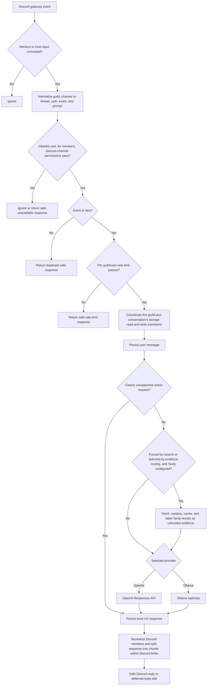

# Architecture

Jarvis is a single Node.js process. It receives Discord gateway events, applies local request controls, optionally grounds a question with web-search results, calls the selected AI provider, and stores only its own conversation records in SQLite. There is no HTTP server or inbound listening port in the application.

## Components

| Component               | Responsibility                                                                                                                                                                                                   | Source                                                                                                          |
| ----------------------- | ---------------------------------------------------------------------------------------------------------------------------------------------------------------------------------------------------------------- | --------------------------------------------------------------------------------------------------------------- |
| Application composition | Loads configuration and persona, constructs adapters, starts the Discord client, runs retention cleanup, and closes resources on `SIGINT` or `SIGTERM`.                                                          | `src/index.ts`                                                                                                  |
| Configuration           | Parses and validates environment settings into immutable configuration objects.                                                                                                                                  | `src/config/config.ts`                                                                                          |
| Discord adapter         | Accepts guild mentions and chat-input commands, checks message permissions, derives channel or thread context, neutralizes reply mentions, and chunks replies.                                                   | `src/discord/handlers.ts`, `src/commands/handlers.ts`, `src/discord/delivery.ts`, `src/utils/chunk-response.ts` |
| Command definitions     | Defines `/ask`, `/search`, `/forget`, `/help`, and `/status` for guild registration.                                                                                                                             | `src/commands/definitions.ts`                                                                                   |
| Conversation service    | Owns shared prompt normalization, input validation, channel access, event de-duplication, per-guild/user rate limits, unsupported-action UX responses, persona mode, history reads, and coordinated persistence. | `src/services/conversation-service.ts`, `src/security/unsupported-action-classifier.ts`                         |
| AI providers            | Implements the shared AI boundary for OpenAI Responses and Ollama chat. Each runtime response is capped at 1,000 output tokens by application composition.                                                       | `src/openai/openai-service.ts`, `src/ollama/ollama-service.ts`, `src/index.ts`                                  |
| Web grounding           | Uses Tavily only when configured and either forced by `/search` or selected by the balanced evidence-routing heuristic.                                                                                          | `src/search/web-search.ts`                                                                                      |
| Storage                 | Defines the conversation-store boundary and provides the SQLite implementation.                                                                                                                                  | `src/storage/conversation-store.ts`, `src/storage/sqlite-conversation-store.ts`                                 |
| Disabled extensions     | Declares disabled-by-default, operator-approved extension shapes; it does not implement or wire tools.                                                                                                           | `src/extensions/contracts.ts`                                                                                   |
| Command registration    | Bulk-registers this application's command definitions in the configured development guild.                                                                                                                       | `scripts/register-commands.ts`                                                                                  |

## Request flow

For direct mentions, the Discord adapter first requires a bot mention, a guild context, an allowed channel, and the bot's channel permissions. Commands make their own guild, channel, allowlist, and input checks before calling the same conversation service. The service is the shared normalization boundary for both ingress paths: it replaces unverified Discord member IDs before persistence or provider use, and it owns event de-duplication and rate limiting for requests that reach it.

Storage transitions for a guild plus conversation are coordinated and serialized. A clear operation advances that conversation's generation, so queued stale storage work is invalidated. The provider call runs outside those coordinated sections, so provider calls for the same conversation can overlap; the subsequent assistant-message append is checked against the generation before it persists.

## Web-grounding boundary

When `TAVILY_API_KEY` is configured, `/search` forces web grounding. Other
prompts are routed by `requiresWebGrounding()`, a deliberately small,
rule-based evidence heuristic. It selects current information; history and
origins; government programs, laws, and regulations; relationships between
named entities; dated statistics, prices, rankings, or quotations; medical,
legal, and financial claims; and evidence-dependent scientific claims.

The same router excludes basic timeless definitions, supplied-text summaries,
ordinary drafting or creative requests, and timeless coding help unless an
additional factual clause requires grounding. This boundary controls evidence,
cost, and latency. It is not an authorization decision or a guarantee that a
selected search will establish a fact.

The normalized prompt is Tavily's query. Tavily returns a bounded result set;
the service retains only nonempty summaries with HTTP(S) URLs, bounds title and
summary lengths, caches equivalent normalized queries in process memory, and
passes the sanitized evidence plus the current date to the selected AI provider.
Before the provider is called, a deterministic evidence gate rejects empty
results, named-entity relationship results that do not explicitly connect both
subjects, conflicting relationship evidence, and government claims without an
official `.gov` or `.mil` source. The provider is still instructed to prefer
primary sources, separate sourced facts from labelled inference, qualify gaps,
and avoid completion by guesswork.

After generation, the wrapper removes model-invented links and validates
evidence-sensitive output against the accepted result text. It withholds the
entire answer when the model introduces unsupported numbers, named entities,
quotations, laws, causal language, or too much novel factual vocabulary.
Successful grounded answers receive only the sanitized links for the evidence
that passed the gate. This deliberately favors a visible abstention over a
polished fabrication. It reduces hallucination risk but is not a general
semantic fact checker.

Known limitation: the rule-based exclusions can produce a narrow false negative
when an explicitly fictional compound prompt has a clearly separated real-world
factual follow-up that itself contains a fiction marker, such as `fictional
characters`. The current policy treats that marker as applying to the follow-up
and suppresses automatic search; `/search` remains the explicit override when
web evidence is wanted.

## Conversation identity and storage

Conversation isolation is by the pair `(guildId, conversationId)`. In a normal channel, `conversationId` is that channel's ID. In a thread, it is the thread ID, while the parent channel ID is retained only for allowlist and persona-mode inheritance. A parent ID on an allowlist permits its threads, but it does not merge their histories. `/forget` clears only the current guild and current channel-or-thread conversation.

`SQLiteConversationStore` owns the `conversation_messages` table. Each record contains `id`, `guild_id`, `conversation_id`, `user_id`, `role`, `content`, `created_at`, and an optional `openai_response_id`. The store reads recent records in chronological order, caps all stored rows after each append, and removes rows older than the configured retention cutoff. It uses SQLite WAL mode and a five-second busy timeout.

The replacement boundary is `ConversationStore`: `append`, `getRecent`, `clear`, `cleanup`, `healthCheck`, and `close`. A different durable store can implement that interface, but it must preserve the conversation service's guild-plus-conversation isolation and lifecycle expectations. Merely pointing a different database at the process is not an architecture, it is wishful plumbing.

## Trust boundaries

Discord message text, user names, interaction options, and Tavily search-result text are untrusted data. They are never trusted instructions. The persona file is an operator-controlled startup input and is loaded separately from Discord content. The local SQLite database and environment-derived credentials are host assets that operators must protect.

The selected provider is an external boundary:

- OpenAI receives the composed instructions, bounded history, prompt, and a derived safety identifier. The Responses request sets `store: false`.
- Ollama receives the composed instructions, bounded history, and prompt at the configured HTTP(S) endpoint.
- Tavily is optional. When web search is invoked, Tavily receives the user's full normalized prompt as its search query. Its bounded, sanitized summaries are evidence only; the grounding wrapper explicitly tells the AI not to treat them as instructions, and an empty usable result set carries an inability-to-verify instruction to the AI provider.

Jarvis has no implemented shell, code-execution, arbitrary-file, GitHub-write, Discord-administration, webhook-management, or autonomous-learning capability. Conversation history supplies request context only. It is not a training loop, and no request can grant the application new authority.

`classifyUnsupportedAction` returns local explanatory responses for obvious
requests that the current release cannot perform. It is deliberately a UX
classifier, not an authorization boundary. It cannot grant an action, validate
Discord authority, or replace permission and configuration checks.

## Extension seams

`AIService` is the provider seam: it accepts instructions, bounded history, prompt, a safety identifier, and an optional web-search flag, then returns text and an optional provider response ID. `WebSearchService` is the read-only search seam used by `WebGroundedAIService`. `ConversationStore` is the persistence seam. `src/extensions/contracts.ts` declares inert, disabled-by-default contracts with `enabled: false` and an `operator approval required` reason for future read-only GitHub, MCP, repository-context, pull-request-summary, recap, gaming-score, and image-description integrations, plus an inert administrator-authorization shape. They are declarations only, not working tools or capabilities, and the authorization shape cannot grant Discord permissions or server authority. No generic tool interface is wired into the application today. Any future tool adapter needs an explicit, least-privilege contract, operator authorization, untrusted-content handling, failure behavior, and tests before it becomes a capability.

See [Configuration](CONFIGURATION.md), [Discord setup](DISCORD_SETUP.md), and [Development](DEVELOPMENT.md) for operational details.
